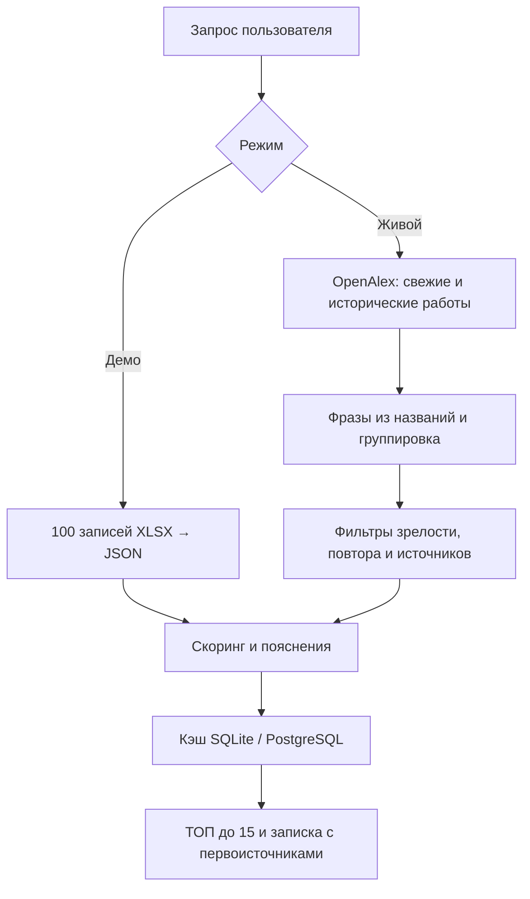

# SignalRadar · радар слабых технологических сигналов

Рабочий прототип для хакатона Газпромбанк.Тех. Русскоязычная аналитическая панель принимает технологическое направление, выводит до 15 кандидатов, открывает аналитическую записку по каждому и показывает ссылки, факторы скоринга и причины исключения. В комплекте два **явно разделённых режима**:

| Режим | Данные | Когда использовать |
| --- | --- | --- |
| Демо | 100 строк предоставленного файла за сентябрь 2026 года, 285 исходных ссылок | Мгновенная презентация и проверка интерфейса без сети |
| Открытый поиск | OpenAlex: недавняя и историческая выборки научных работ | Новый запрос, который не ограничен таблицей; необходим доступ к `api.openalex.org` |

## Запуск за минуту

Нужны **Python 3.8+** (рекомендуется 3.11). Для локального демо не требуются `pip install`, ключи API или интернет.

```bash
cd signalradar
python3 server.py
```

Откройте **http://127.0.0.1:8000**. Введите «технологии в ИИ», «финтех» или «роботы», нажмите «Найти сигналы» и откройте любую строку. Для нового направления выберите «Открытый поиск · OpenAlex». Нужны интернет, разрешение DNS и исходящего HTTPS к `api.openalex.org`. Получение двух выборок иногда занимает несколько десятков секунд; при сетевой ошибке интерфейс сообщает об этом, а не показывает старые данные под видом живых.

Для частых запросов задайте бесплатный ключ OpenAlex: `OPENALEX_API_KEY=ваш_ключ python3 server.py` (в Docker передайте переменную в окружение контейнера). У анонимного доступа ограниченный дневной бюджет; ключ держите только на сервере и не отправляйте в браузер. Актуальные правила описаны в [документации OpenAlex](https://help.openalex.org/api/authentication/).

Другой порт: `PORT=8080 python3 server.py`. Доступ с другой машины: `SIGNAL_HOST=0.0.0.0 PORT=8000 python3 server.py` и разрешите порт в локальной сети. Не выставляйте прототип в публичный интернет без аутентификации и ограничения запросов.

### Docker + PostgreSQL

Из каталога `signalradar`:

```bash
docker compose up --build -d
docker compose ps
```

Откройте **http://localhost:8000**. Остановка: `docker compose down`. Данные PostgreSQL остаются в томе `signalradar-data`; удалить их можно намеренно командой `docker compose down -v`. Приложение ждёт готовности БД. Если Docker недоступен, локальная команда выше использует SQLite без установки зависимостей.

API: `GET /api/health`; `GET /api/search?q=финтех&mode=demo`; `GET /api/search?q=robotics&mode=live`. Параметр `refresh=1` обходит кэш; результаты живого поиска хранятся 24 часа, демо — 30 дней. В ответе есть `candidate_count`, `source_count`, `excluded`, `score_note`, `coverage`, `results` и признак `cached`.

## Что происходит внутри



**Живой поиск.** Произвольная строка направляется в OpenAlex; для нескольких распространённых русских слов задан прозрачный английский эквивалент (`ALIASES` в `engine.py`). Получаем максимум 150 свежих и 100 исторических работ; обычный поиск OpenAlex определяет релевантность входному запросу. Сравниваем заголовочные фразы длиной 2–4 слова: минимум две разные свежие публикации с рабочими ссылками. Отсеиваем несколько заведомо зрелых общих названий, темы с втрое большим числом исторических вхождений и почти одинаковые варианты фраз. Индекс:

`100 × (0,37 × новизна + 0,29 × свидетельства + 0,16 × актуальность + 0,18 × число разных публикаций со ссылками)`.

Точные функции и значения ограничений есть в `engine.py`. **Частоты относятся только к двум полученным порциям результатов**, а «первый год» — минимальный год в новой порции. В частности, ноль в исторической выборке не означает отсутствие публикаций в мире. Индекс в режиме по умолчанию — эвристический приоритет, **не вероятность класса**. Меньше 15 подтверждённых кандидатов означает выдачу меньшего числа, без заполнения вымышленными технологиями.

**Демо.** Использует авторские названия, обоснования, стадии, динамику, компании и ссылки. Числа 3–7 из файла преобразуются в удобную шкалу `35 + 8 × оценка` с верхней границей 91. Даты источников в таблице отсутствуют, поэтому отображается «дата не указана», а не догадка. Компании в поле «кейс» приводятся из таблицы, без утверждения, что все ссылки их подтверждают. Ссылки на первоисточник из документа могут указывать на медиа; для таких ссылок показывается «требует проверки».

**Проверяемость.** Для каждого источника показываются название, URL, дата при наличии, тип, язык из метаданных или «не определён» и предварительная категория доверия. «Высокое» основано лишь на известном домене и **не означает, что содержание статьи проверено**. Содержание английских статей не переводится автоматически: русское описание сообщает только о количестве и теме публикаций, оригинальный заголовок сохранён. Заявления о преимуществах открытой находки не выдумываются: записка предлагает их проверить. Полноценный поиск патентов, аналитических отчётов, чтение полного текста и проверка независимости авторов пока не реализованы.

## Обучение на размеченных данных

Предоставленный Excel содержит **100 положительных примеров и ноль отрицательных**. Обучать бинарный классификатор и заявлять Precision/Recall/F1 75–80% по нему нельзя. Скрипт `train.py` работает, когда организаторы дадут настоящую разметку обоих классов. Подготовьте CSV с колонками:

```csv
recent_count,historic_count,independent_sources,first_seen_year,label
3,0,2,2025,1
15,70,4,2019,0
```

Не используйте эти две иллюстративные строки как обучающую выборку. Для каждой наблюдаемой технологии посчитайте признаки по одной и той же фиксированной процедуре; `label=1` — подтверждённый экспертом слабый сигнал, `0` — зрелая технология/шум. Затем:

```bash
python3 -m pip install -r requirements-ml.txt
python3 train.py /путь/к/размеченным_данным.csv --output data/classifier.joblib
SIGNAL_MODEL=data/classifier.joblib python3 server.py
```

Проверка блокирует менее 20 наблюдений, единственный класс или менее пяти примеров одного класса. Разбиение 75/25 стратифицированное, seed 42; `data/classifier.metrics.json` содержит Precision, Recall, F1, матрицу ошибок и размеры частей. При наличии `SIGNAL_MODEL` ранжирование открытого поиска использует предсказание логистической регрессии вместо эвристического индекса. Загружайте **только локально созданный доверенный** файл модели; `joblib` не предназначен для чужих файлов. Не обещайте качество на другом домене по результату одного holdout; для сдачи оцените утечку между близкими технологиями и сделайте групповую/временную проверку.


## Структура

- `server.py` — HTTP API, кэш и раздача интерфейса; SQLite локально, PostgreSQL в Docker.
- `engine.py` — адаптер OpenAlex, группировка, фильтры, ранжирование, формат источников.
- `train.py` — опциональное обучение и отложенная оценка на экспертной разметке.
- `data/curated.json` — точная выгрузка 100 строк предоставленного Excel.
- `static/` — адаптивная панель и печатная аналитическая записка.
- `tests/` — автономные проверки на небольшом локальном наборе, без запросов в сеть.

Прототип не содержит пользовательской авторизации, распределённого ограничителя запросов и полноценного семантического NLP/патентного корпуса. Эти задачи нужны перед промышленным внедрением. Исходные PDF и XLSX не изменены.
